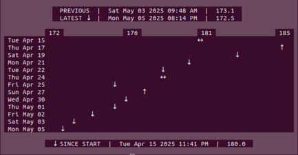

# 🫃 WT 🫃

A very simple body**W**eigh**T** tracking application.

## ⌨️ Usage

Add new entry `wt add [weight]`

Graph weight data `wt graph`

Get app metadata `wt meta`

Get help `wt help`

## 💾 Data

Designed to store data in OS standard directories.

Linux

`$HOME/.local/share/wt-app` or `$XDG_DATA_HOME/wt-app`

Windows

`{User}\AppData\Local\itsthatdude\wt-data\data`

MacOS

`$HOME/Library/Application Support/com.itsthatdude.wt-app`

Data saved as an easily editable plain text file `wt-data.txt`

Entries shall be ordered by date. Incorrectly formatted entries will be ignored.

## 👁️‍🗨️ Contributing

Tested on Ubuntu and Windows 10 machines.

Please report any bugs.

I am open to code feedback though I'm not looking to do much additional work on this project.
It is my first Rust app and I understand it could probably be structured better. The aim
was for simplicity and minimal dependencies.

## 📃 License

[MIT License](LICENSE)